# Active Directory ve DNS Kurulum Rehberi  
## Windows Server 2025 Üzerinde AD DS ve DNS Kurulumu

Bu rehber, Windows Server 2025 Standard Evaluation sistemine Active Directory Domain Services (AD DS) ve DNS Server rollerinin nasıl kurulacağını adım adım açıklar. Kurulum, Server Manager aracılığıyla gerçekleştirilir.

---

## 📑 İçindekiler

- [Adım 1: Server Manager Ana Ekranı](#adım-1-server-manager-ana-ekranı)
- [Adım 2: "Add Roles and Features Wizard" Başlatma](#adım-2-add-roles-and-features-wizard-başlatma)
- [Adım 3: Kurulum Türü Seçimi](#adım-3-kurulum-türü-seçimi)
- [Adım 4: Hedef Sunucu Seçimi](#adım-4-hedef-sunucu-seçimi)
- [Adım 5: Active Directory Domain Services Rolü Seçimi](#adım-5-active-directory-domain-services-rolü-seçimi)
- [Adım 6: Deployment Configuration – Yeni Orman Oluşturma](#adım-6-deployment-configuration--yeni-orman-oluşturma)
- [Adım 7: Domain Controller Seçenekleri](#adım-7-domain-controller-seçenekleri)
- [Adım 8: Ön Koşul Denetimi](#adım-8-ön-koşul-denetimi)
- [Adım 9: Kurulum İlerleme Durumu](#adım-9-kurulum-ilerleme-durumu)
- [Adım 10: Post-deployment Yapılandırma Uyarısı](#adım-10-post-deployment-yapılandırma-uyarısı)
- [Active Directory Yönetimi](#active-directory-yönetimi)
- [Kurulum Sonrası Öneriler](#kurulum-sonrası-öneriler)
- [En İyi Uygulamalar](#en-i̇yi-uygulamalar)
- [Yaygın PowerShell Komutları](#yaygın-powershell-komutları)
- [Doküman Bilgileri](#doküman-bilgileri)

---

## 🖥️ AD DS Kurulum Adımları

### Adım 1: Server Manager Ana Ekranı

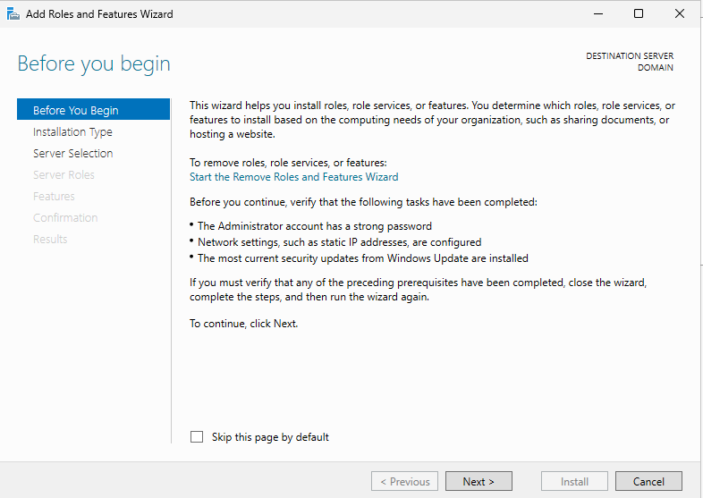

Server Manager açıldığında sol üst köşede **"QUICK START"** bölümü görünür. Bu bölümde:
- **Configure this local server**
- **Add roles and features**
- **Add other servers to manage**

seçenekleri yer alır.

✅ AD DS kurulumuna başlamak için **"Add roles and features"** bağlantısına tıklayın.

---

### Adım 2: "Add Roles and Features Wizard" Başlatma


**Before You Begin** ekranında, kurulum öncesi ön koşullar özetlenir:
- Güçlü bir yönetici şifresi
- Statik IP yapılandırması
- Güncel sistem yamaları

💡 Bu sayfa yalnızca bilgilendiricidir. **Next** butonuna tıklayarak devam edin.

---

### Adım 3: Kurulum Türü Seçimi


**Installation Type** ekranında iki seçenek sunulur:
- **Role-based or feature-based installation**  
- **Remote Desktop Services installation**

✅ **"Role-based or feature-based installation"** seçeneğini işaretleyin. Bu, sunucuya roller eklemek için kullanılır.  
**Next** butonuna tıklayın.

---

### Adım 4: Hedef Sunucu Seçimi

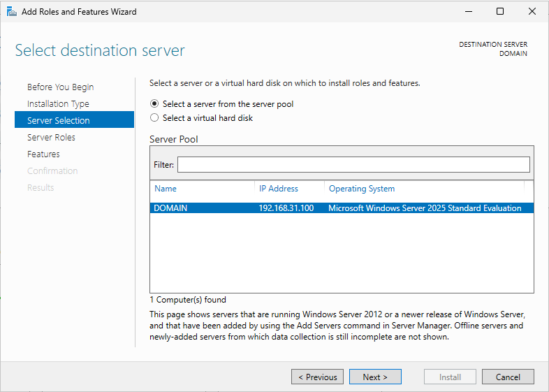

**Server Selection** ekranında:
- **Name**: `DOMAIN`  
- **IP Address**: `192.168.31.100`  
- **Operating System**: `Windows Server 2025 Standard Evaluation`

gibi bilgiler görüntülenir.

✅ Kurulum yapılacak sunucu zaten seçili gelir. Doğru sunucuyu seçtiğinizden emin olduktan sonra **Next** butonuna tıklayın.

---

### Adım 5: Active Directory Domain Services Rolü Seçimi

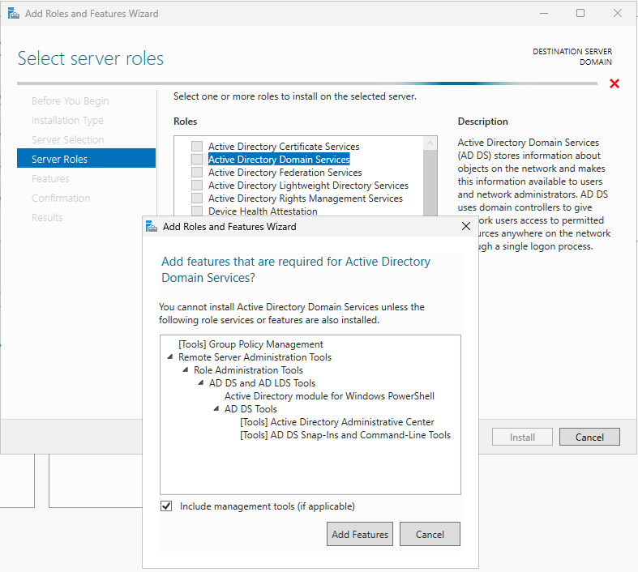

**Server Roles** listesinden **"Active Directory Domain Services"** kutusunu işaretleyin.

Sistem, bu rol için gerekli yönetim araçlarını önerir:
- Group Policy Management
- AD DS and AD LDS Tools
- Active Directory Administrative Center
- AD DS Snap-Ins and Command-Line Tools

✅ **"Include management tools (if applicable)"** seçeneği otomatik işaretlenir.  
Açılan pencerede **Add Features** butonuna tıklayıp **Next** butonuna geçin.

---

### Adım 6: Deployment Configuration – Yeni Orman Oluşturma


AD DS kurulumu tamamlandıktan sonra **"Promote this server to a domain controller"** bağlantısıyla açılan sihirbazda:
- ☑ **Add a new forest** seçeneği işaretlenir  
- **Root domain name**: `serifselen.local` girilir

⚠️ Eğer **"Verification of forest name failed"** uyarısı alırsanız:
- Etki alanı adını basitleştirin (`ad.local` gibi)
- DNS sunucusu ayarlarını kontrol edin

**Next** butonuna tıklayın.

---

### Adım 7: Domain Controller Seçenekleri

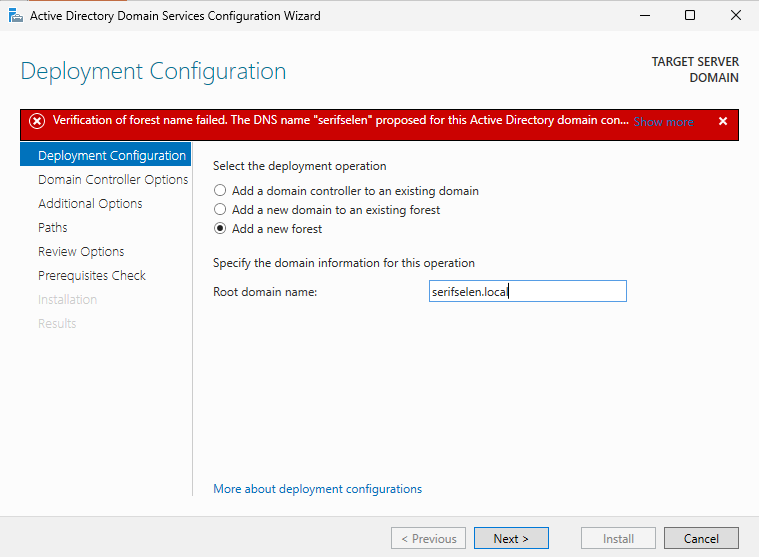

**Domain Controller Options** ekranında:
- **Forest functional level**: `Windows Server 2025`  
- **Domain functional level**: `Windows Server 2025`  
- ☑ **DNS server**  
- ☑ **Global Catalog (GC)**  
- **DSRM password**: Güçlü bir şifre girilir

🔒 DSRM (Directory Services Restore Mode) şifresi, acil durum kurtarma modu için gereklidir.  
**Next** butonuna tıklayın.

---

### Adım 8: Ön Koşul Denetimi

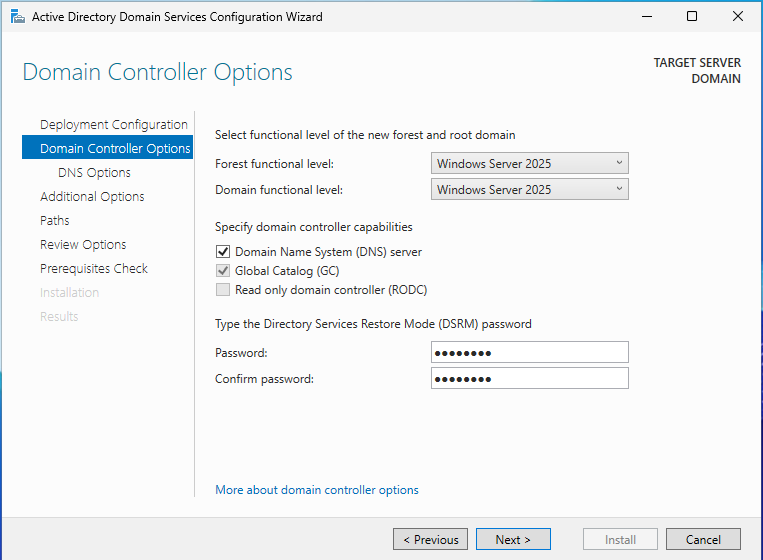

**Prerequisites Check** ekranında:
- ✅ **All prerequisite checks passed successfully**

uyarıları görüntülenir.

⚠️ "A delegation for this DNS server cannot be created…" uyarısı, mevcut bir DNS altyapısı yoksa **ihmal edilebilir**.  
**Install** butonuna tıklayarak kurulumu başlatın.

---

### Adım 9: Kurulum İlerleme Durumu


**Installation progress** ekranında yüklenen bileşenler listelenir:
- Active Directory Domain Services  
- Group Policy Management  
- Remote Server Administration Tools  
- AD DS Tools  
- Active Directory PowerShell modülleri

🔄 Kurulum tamamlandığında sunucu **otomatik olarak yeniden başlatılır**.

---

### Adım 10: Post-deployment Yapılandırma Uyarısı

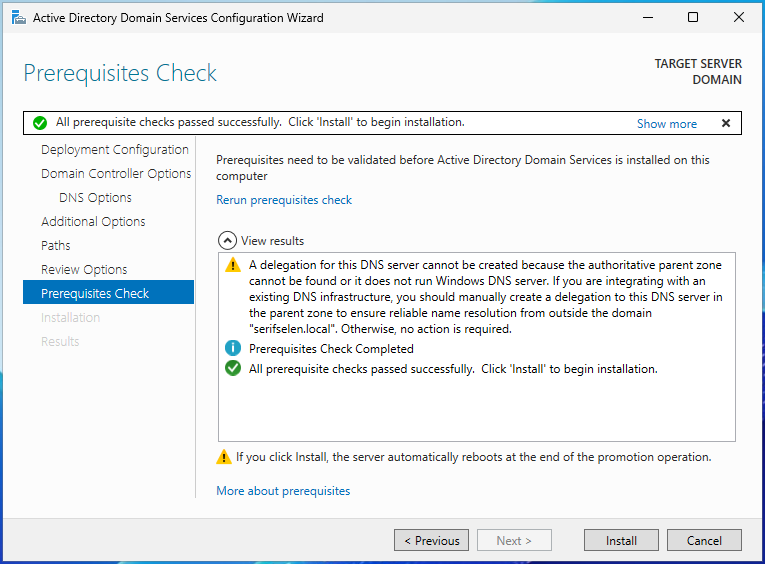

Sunucu yeniden başladığında Server Manager dashboard'unda sağ üst köşede bir uyarı simgesi belirir:

> **Post-deployment Configuration**  
> Configuration required for Active Directory Domain Services at DOMAIN  
> **Promote this server to a domain controller**

✅ Bu uyarı, AD DS yapılandırmasının tamamlanmadığını gösterir.  
Bağlantıya tıklayarak yapılandırmayı tamamlayabilir veya komut satırından `dcpromo` ile devam edebilirsiniz.

---

## 🎉 Kurulum Tamamlandı!

Sunucunuz artık **serifselen.local** etki alanında bir **Domain Controller** olarak çalışmaktadır. **DNS Server** hizmeti de otomatik olarak yapılandırılmıştır.

---

## 📂 Active Directory Yönetimi

### Adım 11: Windows Tools ve Active Directory Araçlarına Erişim

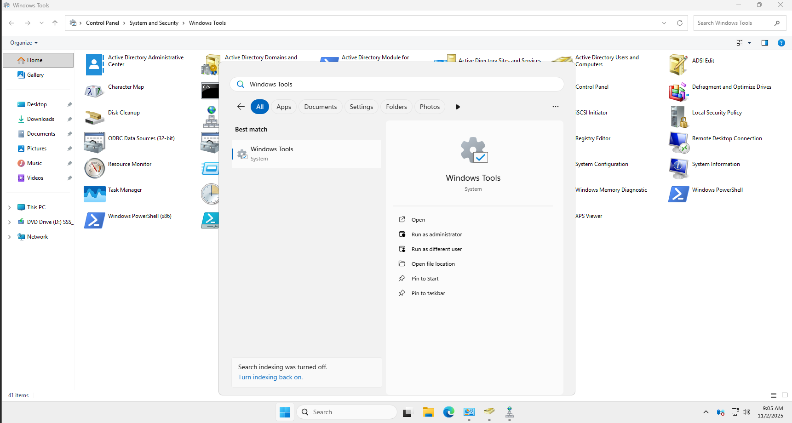

Active Directory yönetim araçlarına erişmek için Windows Tools klasörünü kullanın:

**Erişim Yöntemleri:**
1. **Başlat Menüsü**: Start > Windows Tools
2. **Run Komutları**:
   - AD Users and Computers: `dsa.msc`
   - Group Policy Management: `gpmc.msc`
3. **Server Manager**: Tools menüsünden erişim

✅ **Active Directory Users and Computers** seçeneğine tıklayarak devam edin.

---

### Adım 12: Active Directory Users and Computers Arayüzü

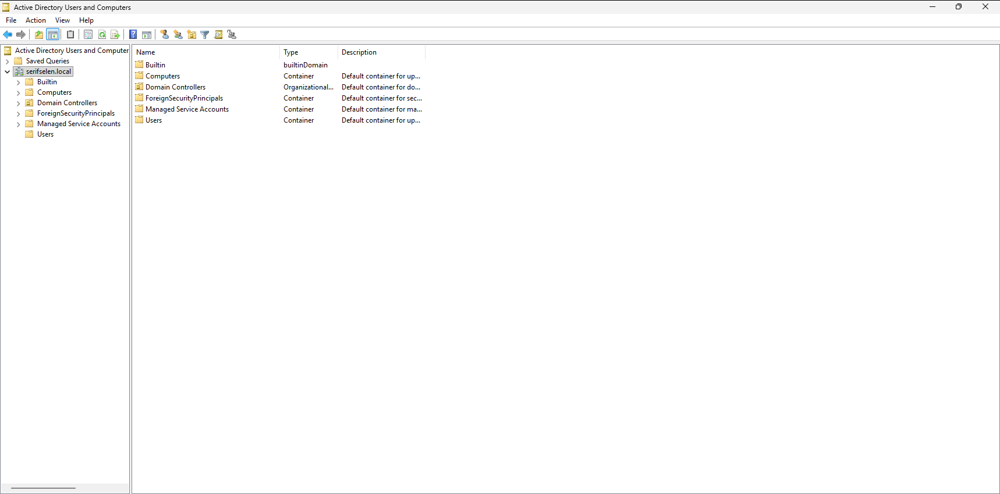

ADUC konsolu açıldığında varsayılan yapı görüntülenir:

**Sol Panel - Domain Yapısı:**
```
📁 serifselen.local
  📁 Builtin
  📁 Computers
  📁 Domain Controllers
  📁 ForeignSecurityPrincipals
  📁 Managed Service Accounts
  📁 Users
```

💡 Bu varsayılan container'lar silinemez ve taşınamaz. Yeni organizasyon yapısı için **Organizational Unit (OU)** oluşturmanız önerilir.

---

### Adım 13: Yeni Öğe Oluşturma Menüsü


Domain üzerine sağ tıklayarak yeni nesneler oluşturabilirsiniz:

**New (Yeni) Alt Menüsü:**
- 📂 **Organizational Unit** ← Organizasyon birimi
- 👥 **Group** ← Güvenlik/Dağıtım grubu
- 👤 **User** ← Kullanıcı hesabı
- 💻 **Computer** ← Bilgisayar hesabı

✅ Yeni bir organizasyon yapısı oluşturmak için **New > Organizational Unit** seçeneğini kullanın.

---

### Adım 14: İlk Organizational Unit (OU) Oluşturma


İlk seviye OU oluşturarak organizasyon yapınızın temelini atın:

**New Object - Organizational Unit Penceresi:**
- **Name:** `Selen Holding`
- ☑ **Protect container from accidental deletion**

🔒 **"Protect container from accidental deletion"** seçeneği:
- OU'nun yanlışlıkla silinmesini önler
- **Üretim ortamlarında mutlaka işaretlenmelidir**

✅ OU adını girin, koruma seçeneğini işaretleyin ve **OK** butonuna tıklayın.

---

### Adım 15: Alt Organizational Unit Oluşturma

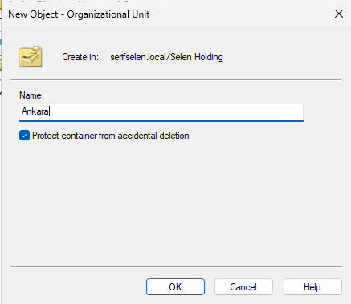

Ana OU altında alt OU'lar oluşturarak hiyerarşik yapı kurun:

**New Object - Organizational Unit Penceresi:**
- **Create in:** `serifselen.local/Selen Holding`
- **Name:** `Ankara`
- ☑ **Protect container from accidental deletion**

🗂️ **Hiyerarşik Yapı Mantığı:**
```
Şirket (Selen Holding)
  └── Lokasyon (Ankara, Istanbul, İzmir)
      └── Departman (IT, Finance, HR)
          └── Kaynak Tipi (Users, Computers, Groups)
```

✅ Alt OU adını girin ve **OK** butonuna tıklayın.

---

### Adım 16: Detaylı OU Yapısı ve Departman Organizasyonu

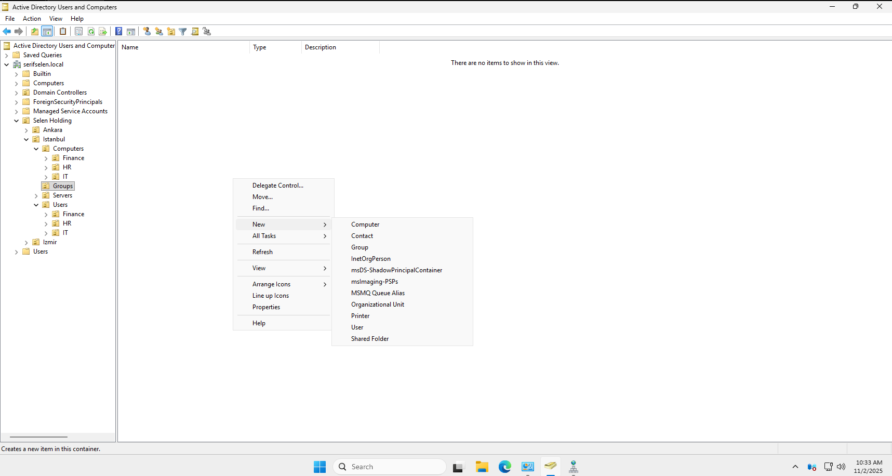

Tam bir organizasyon yapısı oluşturduktan sonra ADUC şu şekilde görünür:

**Önerilen OU Yapısı:**
```
Selen Holding
├── Ankara
├── Istanbul
│   ├── Computers
│   ├── Servers
│   ├── Users
│   │   ├── Finance
│   │   ├── HR
│   │   └── IT
│   └── Groups
└── Izmir
```

---

### Adım 17-18: Güvenlik Grubu Oluşturma

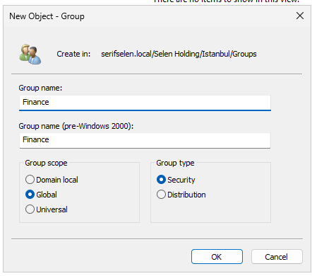


**New Object - Group Penceresi:**
- **Group name:** `Finance`
- **Group scope:** `Global` (Önerilen)
- **Group type:** `Security` (Önerilen)

📚 **Grup Kapsamları:**
| Kapsam | Üyeler | Kullanım Yeri | 
|--------|--------|---------------|
| **Domain Local** | Herhangi bir domain | Sadece kendi domain'inde |
| **Global** | Sadece kendi domain'inden | Herhangi bir domain'de |
| **Universal** | Herhangi bir domain'den | Herhangi bir domain'de |

---

### Adım 19-21: Kullanıcı Hesabı Oluşturma

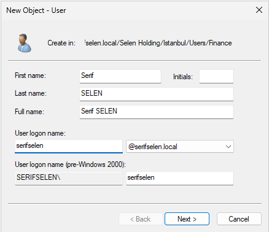
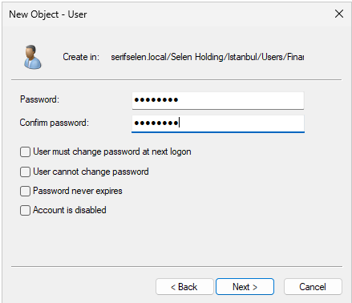


**New Object - User Penceresi:**
- **First name:** `Serif`
- **Last name:** `SELEN`
- **User logon name:** `serifselen@serifselen.local`
- **Password:** Güçlü bir şifre
- ☑ **User must change password at next logon**

🔒 **Güçlü Şifre Gereksinimleri:**
- En az 12 karakter
- 3 farklı karakter türü (büyük, küçük, rakam, özel karakter)
- Sözlükte olmayan

---

### Adım 22-23: Gruba Üye Ekleme

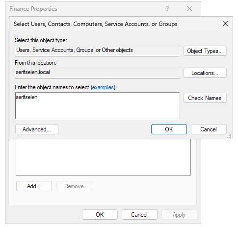

**Finance Properties - Members Sekmesi:**
1. **Add...** butonuna tıklayın
2. **Enter the object names to select:** `serifselen`
3. **Check Names** ile doğrulayın
4. **OK** butonuna tıklayarak ekleyin

✅ Kullanıcı artık Finance grubunun üyesidir.

---

### Adım 24: Group Policy Management Konsolu


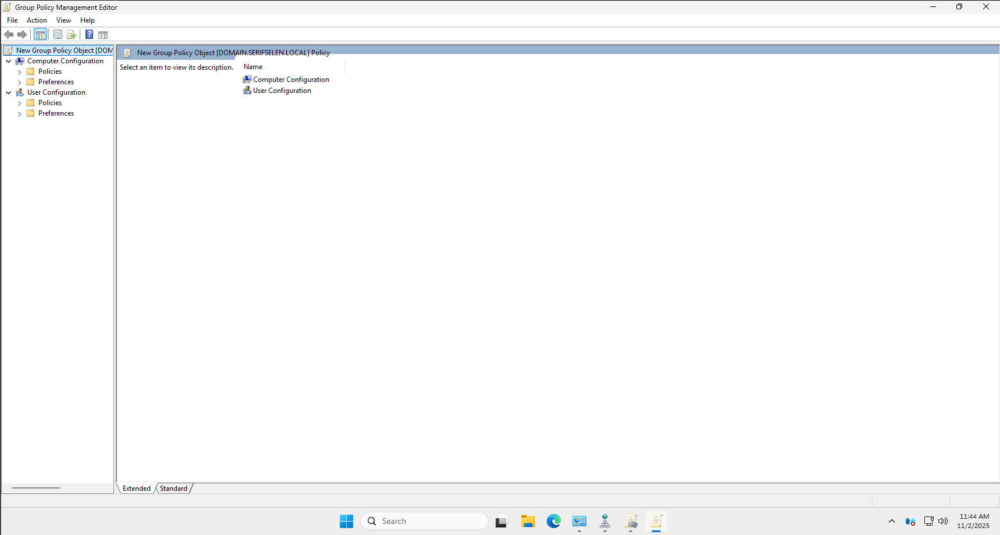

**Group Policy Management** konsolu, GPO'ları merkezi olarak yönetmenizi sağlar:

**Önerilen GPO Stratejisi:**
- **Domain seviyesinde:** Temel güvenlik politikaları
- **Lokasyon OU'ları:** Bölgeye özel ayarlar
- **Departman OU'ları:** Departmana özel politikalar
- **Kullanıcı/Bilgisayar OU'ları:** Kullanıcı veya bilgisayara özel ayarlar

---

## 🔧 Kurulum Sonrası Öneriler

### 1. Kullanıcı ve Grup Yönetimi
- İlk yönetici kullanıcılarını oluşturun
- Departman bazlı güvenlik grupları oluşturun
- AGDLP stratejisini uygulayın (Accounts > Global Groups > Domain Local Groups > Permissions)

### 2. Grup İlkesi (GPO) Yapılandırması
- **Default Domain Policy** ile temel güvenlik ayarlarını yapılandırın:
  - Şifre politikaları
  - Hesap kilitlenme ayarları
  - Denetim politikaları
- Kullanıcı ortamını standartlaştırın

### 3. Diğer Sunucuları Etki Alanına Katma
- Üye sunucuları `serifselen.local` etki alanına ekleyin
- Bilgisayar hesaplarını ilgili OU'lara taşıyın

### 4. Yedekleme ve Kurtarma Planı
- System State yedeklemesi alın
- AD Recycle Bin'i etkinleştirin
- Düzenli yedekleme stratejisi oluşturun

### 5. Güvenlik Duvarı ve Ağ İzolasyonu
- Gerekli portları açın:
  - TCP 53 (DNS)
  - TCP/UDP 88 (Kerberos)
  - TCP 389 (LDAP)
  - TCP 445 (SMB)
  - TCP 3268-3269 (Global Catalog)

---

## 💡 En İyi Uygulamalar

### OU Yapısı:
- Coğrafi ve departman bazlı hiyerarşi oluşturun
- "Protect from accidental deletion" seçeneğini aktif edin
- Açıklayıcı ve standart isimler kullanın (Türkçe karakter kullanmayın)

### Grup Yönetimi:
- AGDLP stratejisini uygulayın:
  - **A**ccounts (Kullanıcı hesapları)
  - **G**lobal Groups (Global gruplar)
  - **D**omain Local Groups (Domain yerel gruplar)
  - **P**ermissions (İzinler)
- Security Groups kullanın (Distribution Groups değil)

### Kullanıcı Hesapları:
- İlk oturumda şifre değişikliği zorunlu tutun
- Karmaşık şifre gereksinimleri tanımlayın
- Standart bir isimlendirme formatı belirleyin:
  - `ad.soyad` (serif.selen)
  - `adsoyad` (serifselen)

### GPO Yönetimi:
- Her GPO'nun tek bir amacı olmalı
- Açıklayıcı isimler kullanın (Örn: "Security - Password Policy")
- Test ortamında deneyin

---

## 🖥️ Yaygın PowerShell Komutları

### Kullanıcı İşlemleri:
```powershell
# Kullanıcı oluşturma
New-ADUser -Name "Serif SELEN" -GivenName "Serif" -Surname "SELEN" `
-SamAccountName "serifselen" -UserPrincipalName "serifselen@serifselen.local" `
-Path "OU=Finance,OU=Users,OU=Istanbul,OU=Selen Holding,DC=serifselen,DC=local" `
-AccountPassword (ConvertTo-SecureString "P@ssw0rd!" -AsPlainText -Force) -Enabled $true

# Kullanıcıyı gruba ekleme
Add-ADGroupMember -Identity "Finance" -Members "serifselen"

# Kullanıcı bilgilerini görüntüleme
Get-ADUser -Identity "serifselen" -Properties *
```

### Grup İşlemleri:
```powershell
# Grup oluşturma
New-ADGroup -Name "Finance" -GroupScope Global -GroupCategory Security `
-Path "OU=Groups,OU=Istanbul,OU=Selen Holding,DC=serifselen,DC=local" `
-Description "Finance department users"

# Grup üyelerini listeleme
Get-ADGroupMember -Identity "Finance" | Select-Object Name, SamAccountName
```

### OU İşlemleri:
```powershell
# OU oluşturma (Korumalı)
New-ADOrganizationalUnit -Name "IT" -Path "OU=Istanbul,OU=Selen Holding,DC=serifselen,DC=local" `
-ProtectedFromAccidentalDeletion $true

# OU'ları listeleme
Get-ADOrganizationalUnit -Filter * | Select-Object Name, DistinguishedName
```

### GPO İşlemleri:
```powershell
# Yeni GPO oluşturma
New-GPO -Name "Security - Workstation Policy" | 
New-GPLink -Target "OU=Computers,OU=Istanbul,OU=Selen Holding,DC=serifselen,DC=local"

# GPO'ları listeleme
Get-GPO -All | Select-Object DisplayName, Owner, CreationTime
```

---

## 📜 Doküman Bilgileri

| Özellik | Değer |
|---------|-------|
| **Yazar** | Serif SELEN |
| **Tarih** | 2 Kasım 2025 |
| **Platform** | VMware Workstation Pro 17 |
| **İşletim Sistemi** | Windows Server 2025 Standard Evaluation |
| **Etki Alanı Adı** | `serifselen.local` |
| **DNS** | Otomatik olarak kurulmuştur |
| **Lisans** | Evaluation (180 gün) |

> ⚠️ Bu doküman eğitim ve test ortamları için hazırlanmıştır. Üretimde lisanslı yazılım ve güvenlik önlemleri kullanılmalıdır.

> 📧 **Destek İçin**: [mserifselen@gmail.com](mailto:mserifselen@gmail.com)  
> 🔗 **GitHub Repository**: [https://github.com/serifselen/Active-Directory-ve-DNS-Kurulum]