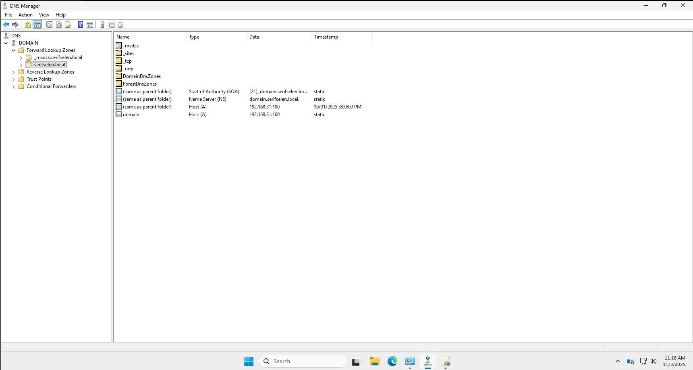
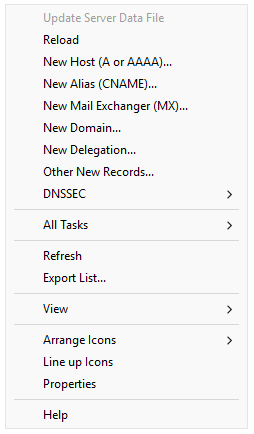
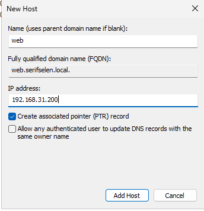

# Active Directory ve DNS Kurulum Rehberi  
## Windows Server 2025 Üzerinde AD DS ve DNS Kurulumu

Bu rehber, **Windows Server 2025 Standard Evaluation** sistemine **Active Directory Domain Services (AD DS)** ve **DNS Server** rollerinin nasıl kurulacağını adım adım açıklar. Kurulum, `Server Manager` aracılığıyla gerçekleştirilir.

---

## 📑 İçindekiler

- [Ön Gereksinimler ve Hazırlık](#ön-gereksinimler-ve-hazırlık)
- [AD DS Kurulum Adımları](#ad-ds-kurulum-adımları)
  - [Adım 1: Server Manager Ana Ekranı](#adım-1-server-manager-ana-ekranı)
  - [Adım 2: "Add Roles and Features Wizard" Başlatma](#adım-2-add-roles-and-features-wizard-başlatma)
  - [Adım 3: Kurulum Türü Seçimi](#adım-3-kurulum-türü-seçimi)
  - [Adım 4: Hedef Sunucu Seçimi](#adım-4-hedef-sunucu-seçimi)
  - [Adım 5: Active Directory Domain Services Rolü Seçimi](#adım-5-active-directory-domain-services-rolü-seçimi)
  - [Adım 6: Deployment Configuration – Yeni Orman Oluşturma](#adım-6-deployment-configuration--yeni-orman-oluşturma)
  - [Adım 7: Domain Controller Seçenekleri](#adım-7-domain-controller-seçenekleri)
  - [Adım 8: Ön Koşul Denetimi](#adım-8-ön-koşul-denetimi)
  - [Adım 9: Kurulum İlerleme Durumu](#adım-9-kurulum-ilerleme-durumu)
  - [Adım 10: Post-deployment Yapılandırma Uyarısı](#adım-10-post-deployment-yapılandırma-uyarısı)
- [Active Directory Yönetimi](#active-directory-yönetimi)
  - [Adım 11: Windows Tools ve Active Directory Araçlarına Erişim](#adım-11-windows-tools-ve-active-directory-araçlarına-erişim)
  - [Adım 12: Active Directory Users and Computers Arayüzü](#adım-12-active-directory-users-and-computers-arayüzü)
  - [Adım 13: Yeni Nesne Oluşturma Menüsü](#adım-13-yeni-nose-oluşturma-menüsü)
  - [Adım 14: İlk Organizational Unit (OU) Oluşturma](#adım-14-i̇lk-organizational-unit-ou-oluşturma)
  - [Adım 15: Alt Organizational Unit Oluşturma](#adım-15-alt-organizational-unit-oluşturma)
  - [Adım 16: OU Hiyerarşisi ve Yapılandırması](#adım-16-ou-hiyerarşisi-ve-yapılandırması)
  - [Adım 17: Güvenlik Grubu Oluşturma](#adım-17-güvenlik-grubu-oluşturma)
  - [Adım 18: Kullanıcı Hesabı Oluşturma](#adım-18-kullanıcı-hesabı-oluşturma)
  - [Adım 19: Gruba Üye Ekleme](#adım-19-gruba-üye-ekleme)
  - [Adım 20: Group Policy Yönetim Konsolu](#adım-20-group-policy-yönetim-konsolu)
- [DNS Yönetimi](#dns-yönetimi)
  - [Adım 21: DNS Manager'a Erişim](#adım-21-dns-managera-erişim)
  - [Adım 22: Host (A) Kaydı Ekleme](#adım-22-host-a-kaydı-ekleme)
  - [Adım 23: Alias (CNAME) Kaydı Ekleme](#adım-23-alias-cname-kaydı-ekleme)
  - [Adım 24: Diğer DNS Kayıtları ve Yönetimi](#adım-24-diğer-dns-kayıtları-ve-yönetimi)
- [Kurulum Sonrası Öneriler](#kurulum-sonrası-öneriler)
- [En İyi Uygulamalar](#en-i̇yi-uygulamalar)
- [Yaygın PowerShell Komutları](#yaygın-powershell-komutları)
- [Doküman Bilgileri](#doküman-bilgileri)

---

## 🖥️ AD DS Kurulum Adımları

### Adım 1: Server Manager Ana Ekranı


`Server Manager` açıldığında sol üst köşede **"QUICK START"** bölümü görünür. Burada:
- **Configure this local server**
- **Add roles and features**
- **Add other servers to manage**

seçenekleri yer alır.

✅ AD DS kurulumuna başlamak için **"Add roles and features"** bağlantısına tıklayın.

---

### Adım 2: "Add Roles and Features Wizard" Başlatma


**Before You Begin** ekranında, kurulum öncesi ön koşullar özetlenir:
- Güçlü bir yönetici şifresi
- Statik IP yapılandırması
- Güncel sistem yamaları

💡 Bu sayfa yalnızca bilgilendiricidir. **Next** butonuna tıklayarak devam edin.

---

### Adım 3: Kurulum Türü Seçimi


**Installation Type** ekranında iki seçenek sunulur:
- **Role-based or feature-based installation**  
- **Remote Desktop Services installation**

✅ **"Role-based or feature-based installation"** seçeneğini işaretleyin. Bu, sunucuya roller eklemek için kullanılır.  
**Next** butonuna tıklayın.

---

### Adım 4: Hedef Sunucu Seçimi


**Server Selection** ekranında:
- **Name**: `DOMAIN`  
- **IP Address**: `192.168.31.100`  
- **Operating System**: `Windows Server 2025 Standard Evaluation`

gibi bilgiler görüntülenir.

✅ Kurulum yapılacak sunucu zaten seçili gelir. Doğru sunucuyu seçtiğinizden emin olduktan sonra **Next** butonuna tıklayın.

---

### Adım 5: Active Directory Domain Services Rolü Seçimi


**Server Roles** listesinden **"Active Directory Domain Services"** kutusunu işaretleyin.

Sistem, bu rol için gerekli yönetim araçlarını önerir:
- Group Policy Management
- AD DS and AD LDS Tools
- Active Directory Administrative Center
- AD DS Snap-Ins and Command-Line Tools

✅ **"Include management tools (if applicable)"** seçeneği otomatik işaretlenir.  
Açılan pencerede **Add Features** butonuna tıklayıp **Next** butonuna geçin.

---

### Adım 6: Deployment Configuration – Yeni Orman Oluşturma


AD DS kurulumu tamamlandıktan sonra **"Promote this server to a domain controller"** bağlantısıyla açılan sihirbazda:
- ☑ **Add a new forest** seçeneği işaretlenir  
- **Root domain name**: `serifselen.local` girilir

⚠️ Eğer **"Verification of forest name failed"** uyarısı alırsanız:
- Etki alanı adını basitleştirin (`ad.local` gibi)
- DNS sunucusu ayarlarını kontrol edin

**Next** butonuna tıklayın.

---

### Adım 7: Domain Controller Seçenekleri


**Domain Controller Options** ekranında:
- **Forest functional level**: `Windows Server 2025`  
- **Domain functional level**: `Windows Server 2025`  
- ☑ **DNS server**  
- ☑ **Global Catalog (GC)**  
- **DSRM password**: Güçlü bir şifre girilir

🔒 DSRM (Directory Services Restore Mode) şifresi, acil durum kurtarma modu için gereklidir.  
**Next** butonuna tıklayın.

---

### Adım 8: Ön Koşul Denetimi


**Prerequisites Check** ekranında:
- ✅ **All prerequisite checks passed successfully**

uyarıları görüntülenir.

⚠️ "A delegation for this DNS server cannot be created…" uyarısı, mevcut bir DNS altyapısı yoksa **ihmal edilebilir**.  
**Install** butonuna tıklayarak kurulumu başlatın.

---

### Adım 9: Kurulum İlerleme Durumu


**Installation progress** ekranında yüklenen bileşenler listelenir:
- Active Directory Domain Services  
- Group Policy Management  
- Remote Server Administration Tools  
- AD DS Tools  
- Active Directory PowerShell modülleri

🔄 Kurulum tamamlandığında sunucu **otomatik olarak yeniden başlatılır**.

---

### Adım 10: Post-deployment Yapılandırma Uyarısı


Sunucu yeniden başladığında `Server Manager` dashboard'unda sağ üst köşede bir uyarı simgesi belirir:

> **Post-deployment Configuration**  
> Configuration required for Active Directory Domain Services at DOMAIN  
> **Promote this server to a domain controller**

✅ Bu uyarı, AD DS yapılandırmasının tamamlanmadığını gösterir.  
Bağlantıya tıklayarak yapılandırmayı tamamlayabilir veya komut satırından `dcpromo` ile devam edebilirsiniz.

---

## 🎉 Kurulum Tamamlandı!

Sunucunuz artık **serifselen.local** etki alanında bir **Domain Controller** olarak çalışmaktadır. **DNS Server** hizmeti de otomatik olarak yapılandırılmıştır.

---

## 📂 Active Directory Yönetimi

### Adım 11: Windows Tools ve Active Directory Araçlarına Erişim


Active Directory yönetim araçlarına erişmek için **Windows Tools** klasörünü kullanın.

#### Erişim Yöntemleri:

**Yöntem 1: Başlat Menüsü**
1. **Start** menüsüne tıklayın
2. **Windows Tools** yazın
3. Açılan klasörde aşağıdaki araçlar bulunur:
   - **Active Directory Administrative Center**
   - **Active Directory Domains and Trusts**
   - **Active Directory Module for Windows PowerShell**
   - **Active Directory Sites and Services**
   - **Active Directory Users and Computers** ← Yaygın kullanılan

**Yöntem 2: Doğrudan Run Komutları**

| Araç | Run Komutu |
|------|-----------|
| Active Directory Users and Computers | `dsa.msc` |
| Active Directory Sites and Services | `dssite.msc` |
| Active Directory Domains and Trusts | `domain.msc` |
| Group Policy Management | `gpmc.msc` |

**Yöntem 3: Server Manager**
- **Server Manager** > **Tools** menüsünden erişim

✅ **Active Directory Users and Computers** seçeneğine tıklayarak devam edin.

---

### Adım 12: Active Directory Users and Computers Arayüzü


**Active Directory Users and Computers (ADUC)** konsolu açıldığında varsayılan yapı görüntülenir.

#### Sol Panel - Domain Yapısı:
```
📁 Active Directory Users and Computers
  📁 Saved Queries
  📁 serifselen.local
    📁 Builtin
    📁 Computers
    📁 Domain Controllers
    📁 ForeignSecurityPrincipals
    📁 Managed Service Accounts
    📁 Users
```

#### Sağ Panel - Container İçeriği:

| Name | Type | Description |
|------|------|-------------|
| 📁 Builtin | builtinDomain | Default container for up... |
| 📁 Computers | Container | Default container for up... |
| 📁 Domain Controllers | Organizational... | Default container for do... |
| 📁 ForeignSecurityPrincipals | Container | Default container for sec... |
| 📁 Managed Service Accounts | Container | Default container for ma... |
| 📁 Users | Container | Default container for up... |

💡 Bu varsayılan container'lar silinemez ve taşınamaz. Yeni organizasyon yapısı için **Organizational Unit (OU)** oluşturmanız önerilir.

---

### Adım 13: Yeni Nesne Oluşturma Menüsü


Domain üzerine sağ tıklayarak yeni nesneler oluşturabilirsiniz.

#### Sağ Tıklama Menüsü - New (Yeni) Alt Menüsü:

| İkon | Nesne Tipi | Açıklama |
|------|-----------|----------|
| 💻 | **Computer** | Bilgisayar hesabı |
| 👤 | **Contact** | İletişim nesnesi |
| 👥 | **Group** | Güvenlik veya dağıtım grubu |
| 👤 | **InetOrgPerson** | İnternet organizasyon kişisi |
| 📂 | **Organizational Unit** | **← Organizasyon birimi** |
| 🖨️ | **Printer** | Yazıcı nesnesi |
| 👤 | **User** | Kullanıcı hesabı |
| 📁 | **Shared Folder** | Paylaşılan klasör |

✅ Yeni bir organizasyon yapısı oluşturmak için **New > Organizational Unit** seçeneğini kullanın.

---

### Adım 14: İlk Organizational Unit (OU) Oluşturma


İlk seviye OU oluşturarak organizasyon yapınızın temelini atın.

#### New Object - Organizational Unit Penceresi:

📁 **Create in:** `serifselen.local/`

**Name:** 
```
Selen Holding
```

☑ **Protect container from accidental deletion**

#### 🔒 Önemli Güvenlik Özelliği:

**"Protect container from accidental deletion"** seçeneği:
- OU'nun yanlışlıkla silinmesini önler
- Active Directory'de Object Protection özelliğini aktifleştirir
- **Üretim ortamlarında mutlaka işaretlenmelidir**

✅ OU adını girin, koruma seçeneğini işaretleyin ve **OK** butonuna tıklayın.

---

### Adım 15: Alt Organizational Unit Oluşturma


Ana OU altında alt OU'lar oluşturarak hiyerarşik yapı kurun.

#### New Object - Organizational Unit Penceresi:

📁 **Create in:** `serifselen.local/Selen Holding`

**Name:** 
```
Ankara
```

☑ **Protect container from accidental deletion**

#### 🗂️ Hiyerarşik Yapı Mantığı:
```
Şirket (Selen Holding)
  └── Lokasyon (Ankara, Istanbul, İzmir)
      └── Departman (IT, Finance, HR)
          └── Kaynak Tipi (Users, Computers, Groups)
```

✅ Alt OU adını girin ve **OK** butonuna tıklayın. Aynı yöntemi kullanarak `Istanbul` ve `Izmir` OU'larını da oluşturun.

---

### Adım 16: OU Hiyerarşisi ve Yapılandırması


Tam bir organizasyon yapısı oluşturduktan sonra ADUC şu şekilde görünür:

#### Tamamlanmış OU Yapısı:
```
📁 serifselen.local
  📁 Selen Holding
    📁 Ankara
      📁 Users
      📁 Computers
      📁 Groups
    📁 Istanbul
      📁 Users
        📁 Finance
        📁 HR
        📁 IT
      📁 Computers
      📁 Groups
    📁 Izmir
      📁 Users
      📁 Computers
      📁 Groups
```

#### Önerilen OU Tasarım İlkeleri:
- **Maksimum 10 seviye** OU derinliği
- **Türkçe karakterler** kullanmayın
- **Açıklayıcı isimler** kullanın
- **OU isimlendirme standardı** oluşturun (Lokasyon > Departman > Kaynak Tipi)

---

### Adım 17: Güvenlik Grubu Oluşturma


#### Grup Oluşturma Adımları:

1. İlgili OU üzerinde sağ tık → **New** → **Group**
2. **Group name:** `Finance`
3. **Group name (pre-Windows 2000):** `Finance`
4. **Group scope:** `Global` (Önerilen)
5. **Group type:** `Security` (Önerilen)

#### Grup Kapsamları ve Kullanım Senaryoları:

| Kapsam | Üyeler | Kullanım Yeri | Senaryo |
|--------|--------|---------------|---------|
| **Domain Local** | Herhangi bir domain | Yalnızca kendi domain'indeki kaynaklar | Dosya sunucusu paylaşımlarına erişim |
| **Global** | Sadece kendi domain'inden | Tüm forest'te kullanılabilir | Departman grupları |
| **Universal** | Tüm domain'lerden | Tüm forest'te kullanılabilir | Çok domain'li organizasyonlar |

#### AGDLP Stratejisi:
- **A**ccounts → Kullanıcı hesapları
- **G**lobal Groups → Kullanıcıları gruplar
- **D**omain Local Groups → Kaynak izinleri
- **P**ermissions → İzin atamaları

---

### Adım 18: Kullanıcı Hesabı Oluşturma


#### Kullanıcı Oluşturma Adımları:

1. İlgili OU üzerinde sağ tık → **New** → **User**
2. **Kişisel Bilgiler:**
   - First name: `Serif`
   - Last name: `SELEN`
   - Full name: `Serif SELEN`
3. **Oturum Açma Bilgileri:**
   - User logon name: `serifselen` @ `serifselen.local`
4. **Şifre Ayarları:**
   - Password: `GüçlüBirŞifre123!`
   - ☑ **User must change password at next logon**

#### Güçlü Şifre Gereksinimleri:
- En az **14 karakter**
- **4 karakter kategorisinden** en az 3'ü:
  - Büyük harfler (A-Z)
  - Küçük harfler (a-z)
  - Rakamlar (0-9)
  - Özel karakterler (!@#$%^&*)
- Sözlükte olmayan kelimeler

---

### Adım 19: Gruba Üye Ekleme


#### Üye Ekleme Adımları:

1. Grup üzerinde sağ tık → **Properties** → **Members** sekmesi
2. **Add...** butonuna tıklayın
3. **Select Users, Contacts, Computers** penceresinde:
   - **Enter the object names to select:** `serifselen`
   - **Check Names** butonuna tıklayarak doğrulama yapın
4. **OK** butonuna tıklayarak ekleyin

#### Üyelik Yönetimi Komutları:
```powershell
# Kullanıcıyı gruba ekleme
Add-ADGroupMember -Identity "Finance" -Members "serifselen"

# Grup üyelerini listeleme
Get-ADGroupMember -Identity "Finance" | 
Select-Object Name, SamAccountName, ObjectClass
```

---

### Adım 20: Group Policy Yönetim Konsolu


**Group Policy Management (GPM)** konsolu, GPO'ları merkezi olarak yönetmenizi sağlar.

#### GPMC Arayüz Yapısı:
```
📁 Group Policy Management
  📁 Forest: serifselen.local
    📁 Domains
      📁 serifselen.local
        📋 Default Domain Policy
        📋 Default Domain Controllers Policy
        📁 Group Policy Objects
          📋 New Group Policy Object
```

#### Yeni GPO Oluşturma:
1. **Group Policy Objects** klasörü üzerinde sağ tık → **New**
2. **Name** alanına: `Security - Password Policy`
3. **OK** butonuna tıklayın

#### Temel GPO Kategorileri:

**Computer Configuration:**
- Windows Settings
  - Security Settings
    - Account Policies
    - Local Policies
    - Public Key Policies
- Administrative Templates
  - System
  - Network
  - Windows Components

**User Configuration:**
- Policies
  - Administrative Templates
  - Control Panel
  - Windows Components
- Preferences
  - Windows Settings
  - Control Panel Settings

---

## 🌐 DNS Yönetimi

### Adım 21: DNS Manager'a Erişim

DNS Manager, Active Directory Domain Services kurulumu sırasında otomatik olarak yüklendi ve sunucunuzda çalışır durumdadır. DNS yönetimine erişmek için:

**Yöntem 1: Başlat Menüsü**
1. **Start** menüsüne tıklayın
2. **Windows Tools** yazın
3. Açılan listeden **DNS** seçeneğine tıklayın

**Yöntem 2: Run Komutu**
- `dns.msc` komutunu çalıştırın

**Yöntem 3: Server Manager**
- **Server Manager** > **Tools** > **DNS** seçeneği



DNS Manager arayüzünde:
- Sol panelde DNS hiyerarşisi (Forward Lookup Zones, Reverse Lookup Zones)
- Orta panelde seçili zone'un kayıtları
- Sağ panelde kayıtların detayları

DNS Manager arayüzünde **serifselen.local** zone'u otomatik olarak oluşturulmuştur ve temel kayıtlar (SOA, NS, A) bulunmaktadır.

---

### Adım 22: Host (A) Kaydı Ekleme

Host (A) kayıtları, isimleri IP adreslerine eşleyen temel DNS kayıtlarıdır. Web sunucuları, mail sunucuları gibi kaynaklar için kullanılır.

#### Host Kaydı Ekleme Adımları:

1. **DNS Manager**'da **Forward Lookup Zones** > **serifselen.local** üzerine sağ tıklayın
2. **New Host (A or AAAA)...** seçeneğini seçin
3. Açılan pencerede:
   - **Name**: `web` (kaydı temsil edecek isim)
   - **IP address**: `192.168.31.200` (sunucunun IP adresi)
   - ☑ **Create associated pointer (PTR) record** (ters DNS kaydı oluştur)
   - ☐ **Allow any authenticated user to update DNS records** (opsiyonel)



4. **Add Host** butonuna tıklayın

#### Teknik Detaylar:
- **FQDN**: `web.serifselen.local` olarak oluşturulur
- **A kaydı**: İsimden IP'ye çözümleme yapar
- **PTR kaydı**: IP'den isme çözümleme yapar (tüm sunucular için önerilir)
- **TTL**: Varsayılan 1 saat (3600 saniye)

#### PowerShell ile Host Kaydı Ekleme:
```powershell
# Host (A) kaydı oluşturma
Add-DnsServerResourceRecordA -ZoneName "serifselen.local" -Name "web" -IPv4Address "192.168.31.200" -CreatePtr

# Host kayıtlarını listeleme
Get-DnsServerResourceRecord -ZoneName "serifselen.local" -Name "web" -RRType A
```

---

### Adım 23: Alias (CNAME) Kaydı Ekleme

CNAME (Canonical Name) kayıtları, bir ana kayda (A kaydı) referans veren takma isim kayıtlarıdır. Sunucu isimlerini değiştirmeden farklı isimlerle erişim sağlamak için kullanılır.

#### CNAME Kaydı Ekleme Adımları:

1. **DNS Manager**'da **Forward Lookup Zones** > **serifselen.local** üzerine sağ tıklayın
2. **New Alias (CNAME)...** seçeneğini seçin
3. Açılan pencerede:
   - **Alias name**: `www` (takma isim)
   - **Fully qualified domain name (FQDN) for target host**: `web.serifselen.local.` (nokta ile bitmelidir)
   - ☐ **Allow any authenticated user to update DNS records** (opsiyonel)

4. **OK** butonuna tıklayın

#### CNAME Kaydı Örneği:
- `www.serifselen.local` → `web.serifselen.local` (A kaydı)

#### Teknik Detaylar:
- **CNAME kaydı**: Takma isim oluşturur
- **FQDN sonunda nokta**: Mutlak yol belirtir
- **Kullanım Senaryoları**: 
  - Web sunucuları için www takma ismi
  - Farklı uygulamalar için farklı isimler

#### PowerShell ile CNAME Kaydı Ekleme:
```powershell
# CNAME kaydı oluşturma
Add-DnsServerResourceRecordCName -ZoneName "serifselen.local" -Name "www" -HostNameAlias "web.serifselen.local." -TimeToLive 01:00:00

# CNAME kayıtlarını listeleme
Get-DnsServerResourceRecord -ZoneName "serifselen.local" -Name "www" -RRType CNAME
```

---

### Adım 24: Diğer DNS Kayıtları ve Yönetimi

#### DNS Menü Seçenekleri:



DNS Manager'da sağ tık menüsünden erişilebilen temel seçenekler:

| Seçenek | Açıklama | Kullanım Senaryosu |
|---------|----------|-------------------|
| **New Host (A or AAAA)** | IPv4/IPv6 adres kaydı | Sunucu isimleri |
| **New Alias (CNAME)** | Takma isim kaydı | Web sunucu takma isimleri |
| **New Mail Exchanger (MX)** | Mail sunucu kaydı | E-posta yönlendirme |
| **New Domain** | Alt domain oluşturma | Alt alan adları |
| **New Delegation** | Yetkilendirme | DNS hiyerarşisi |
| **Other New Records** | Diğer kayıtlar | TXT, SRV, PTR vb. |

#### DNS Zone Yönetimi:

- **Forward Lookup Zones**: İsimden IP'ye çözümleme
- **Reverse Lookup Zones**: IP'den isme çözümleme
- **Trust Points**: Güvenilir DNS ilişkileri
- **Conditional Forwarders**: Belirli alan adlarını yönlendirme

#### Temel DNS Yönetim İşlemleri:

1. **DNS Yenileme**:
   - **Action** > **Reload** ile zone'ı yeniden yükle
   - **ipconfig /flushdns** ile client cache temizle

2. **DNS Replikasyonu**:
   - **serifselen.local** zone'u üzerine sağ tık > **Properties** > **Zone Transfers** 
   - Replikasyon ayarlarını yapılandırın

3. **DNS Güvenliği**:
   - **serifselen.local** zone'u > **Properties** > **Security** sekmesi
   - DNS kayıtlarına erişim izinlerini yönetin

#### PowerShell ile DNS Yönetimi:
```powershell
# Tüm DNS kayıtlarını listeleme
Get-DnsServerResourceRecord -ZoneName "serifselen.local" | 
Select-Object Name, Type, RecordData

# DNS zone'ını aktar
Export-DnsServerZone -Name "serifselen.local" -Path "C:\DNS_Backups\serifselen.local.dns"

# DNS replikasyonunu test et
Test-DnsServer -IPAddress "127.0.0.1" -ZoneName "serifselen.local" -Context PrimaryServer
```

---

## 🔧 Kurulum Sonrası Öneriler

### 1. Active Directory Altyapısı
- **Forest ve Domain Fonksiyon Seviyelerini** Windows Server 2025 olarak yükseltin
- **AD Recycle Bin** özelliğini etkinleştirin
- **Sites and Services** yapılandırması yapın
- **Global Catalog** sunucularını çoğaltın

### 2. Kimlik ve Erişim Yönetimi
- **Fine-Grained Password Policies** oluşturun
- **Kullanıcı hesap şablonları** hazırlayın
- **Self-service password reset** çözümleri dağıtın
- **Multi-factor authentication** entegrasyonu sağlayın

### 3. Güvenlik ve Denetim
- **Advanced Audit Policy** yapılandırın
- **Credential Guard** ve **Device Guard** özelliklerini etkinleştirin
- **Privileged Access Management (PAM)** uygulayın
- **SIEM entegrasyonu** sağlayın (Azure Sentinel, Splunk vb.)

### 4. Performans ve Ölçeklenebilirlik
- **Read-Only Domain Controllers (RODC)** dağıtın
- **DNS Load Balancing** yapılandırın
- **DC Locator** optimizasyonu yapın
- **Site Link** maliyetlerini optimize edin

### 5. Yedekleme ve Kurtarma
- **System State Backup** rutini oluşturun
- **AD DS Snapshot** alın
- **Authoritative Restore** prosedürleri hazırlayın
- **Disaster Recovery** senaryolarını test edin

---

## 💡 En İyi Uygulamalar

### OU Tasarımı:
- **Maksimum 10 seviye** OU derinliği önerilir
- **Türkçe karakterler** kullanmayın
- **Açıklayıcı isimler** kullanın (IT_Dept yerine IT)
- **OU isimlendirme standardı** oluşturun

### Grup Yönetimi:
- **AGDLP stratejisini** uygulayın
- **Universal Group** kullanımını minimum seviyede tutun
- **Nested Groups** ile yönetim karmaşıklığını azaltın
- **Grup üyelikleri** için otomasyon kullanın

### GPO Yönetimi:
- **GPO isimlendirme standardı** oluşturun:
  ```
  [Kapsam] - [Kategori] - [Açıklama]
  Örn: DOMAIN - Security - Password Policy
       IST - Software - Office 365 Deployment
  ```
- **GPO'ları test ortamında** doğrulayın
- **GPO yedekleri** alın (`Backup-GPO` cmdlet'i)
- **GPO raporları** düzenli olarak oluşturun

### DNS Yönetimi:
- **Kısa ve açıklayıcı isimler** kullanın (www, mail, web)
- **Tüm ana sunucular için PTR kaydı** oluşturun
- **DNS zone'larını yedekleyin** düzenli aralıklarla
- **DNS cache'i temizleme** rutinleri ekleyin

---

## 🖥️ Yaygın PowerShell Komutları

### Active Directory Modülü Yüklemesi:
```powershell
# RSAT: Active Directory Domain Services Tools yükleme
Add-WindowsFeature RSAT-AD-PowerShell

# Modülü içe aktarma
Import-Module ActiveDirectory
```

### DNS Yönetimi PowerShell Komutları:
```powershell
# Temel DNS sorguları
Resolve-DnsName -Name "www.serifselen.local" -Type A
Resolve-DnsName -Name "192.168.31.100" -Type PTR

# DNS kayıtlarını listeleme
Get-DnsServerResourceRecord -ZoneName "serifselen.local" | 
Where-Object {$_.Type -eq 'A' -or $_.Type -eq 'CNAME'} | 
Select-Object Name, Type, RecordData

# DNS zone'ını export etme
Export-DnsServerZone -Name "serifselen.local" -Path "C:\DNS_Backups\serifselen.local.dns"

# DNS cache'i temizleme
Clear-DnsClientCache
```

---

## 📜 Doküman Bilgileri

| Özellik | Değer |
|---------|-------|
| **Yazar** | Serif SELEN |
| **Son Güncelleme** | 2 Kasım 2025 |
| **Platform** | VMware Workstation Pro 17 |
| **İşletim Sistemi** | Windows Server 2025 Standard Evaluation |
| **Etki Alanı Adı** | `serifselen.local` |
| **Forest Fonksiyon Seviyesi** | Windows Server 2025 |
| **Domain Fonksiyon Seviyesi** | Windows Server 2025 |
| **Lisans** | Evaluation (180 gün) |
| **Test Ortamı** | Tek DC, Tek Bölge |

> ⚠️ **UYARI:** Bu doküman **eğitim ve test ortamları** için hazırlanmıştır. Üretim sistemlerinde lisanslı yazılımlar ve resmi Microsoft belgeleri kullanılmalıdır.

> 📧 **Destek İçin:** [serif.selen@outlook.com](mailto:serif.selen@outlook.com)  
> 🔗 **GitHub Repository:** [https://github.com/serifselen/Active-Directory-ve-DNS-Kurulum](https://github.com/serifselen/Active-Directory-ve-DNS-Kurulum)
